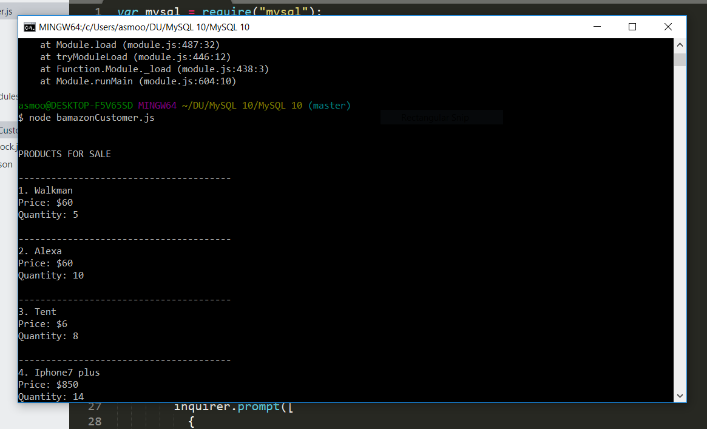
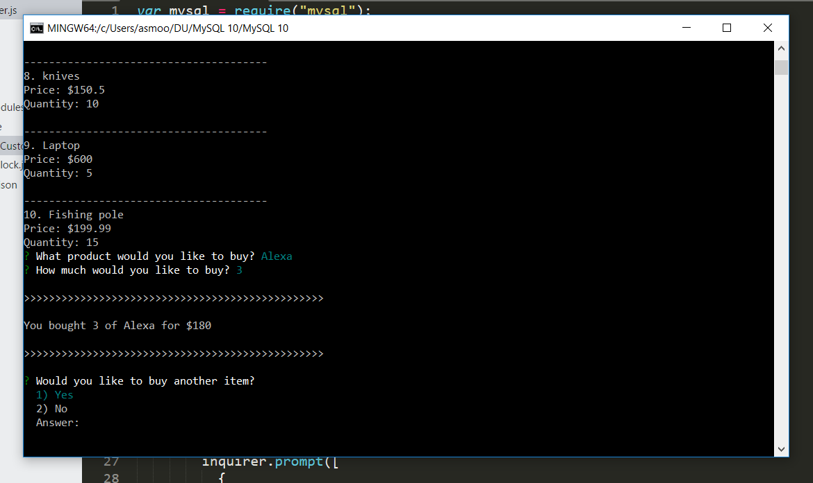

# MySql
coding bootcamp homework

Going into node bamazonCustomer.js will bring up all the items in the bamazon database

Then it will ask what product you would like to buy

First you pick the item and then it asks how much of the item you would like to buy. When you are done filling in the questions it will show how much of the item you bought and the total price.

